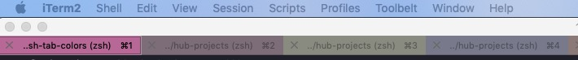

# zsh-tab-random-colors

## Description

* This script helps you to identify the tabs in iTerms2 with different colors


## Steps to install(require zsh)

* cd $ZSH_CUSTOM/plugins/
* mkdir zsh-tab-random-colors
* download zsh-tab-random-colors.plugin.zsh
* vim ~/.zshrc
* modify plugin part

  ```
  plugins=(
    git
    zsh-tab-random-colors
  )
  ```
 * source ~/.zshrc 
